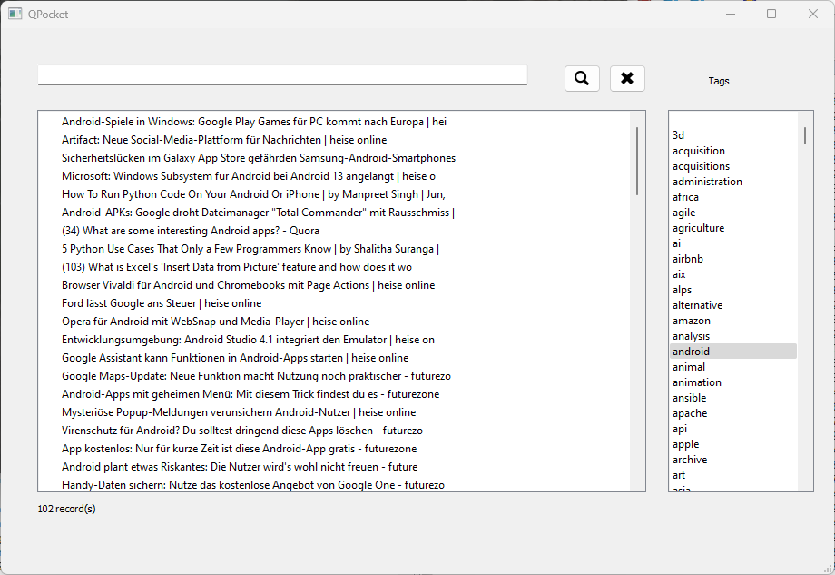

# QPocket
## Abstract
QPocket is a Python program with a GUI allowing to display, search and filter bookmarks exported from getpocket.com
## Description
QPocket reads a html file exported from getpocket.com/export and displays all bookmarks in a list on the left and all tags used in a list on the right. Bookmarks can be searched using the entry field at the top or filtered by selecting one or more tags in the list box on the right, Clicking a bookmark will open up a browser using the corresponding URL.

## Installation
Besides cloning this repo also the pythpn package pyqt needs to be installed:

`pip install pyqt`